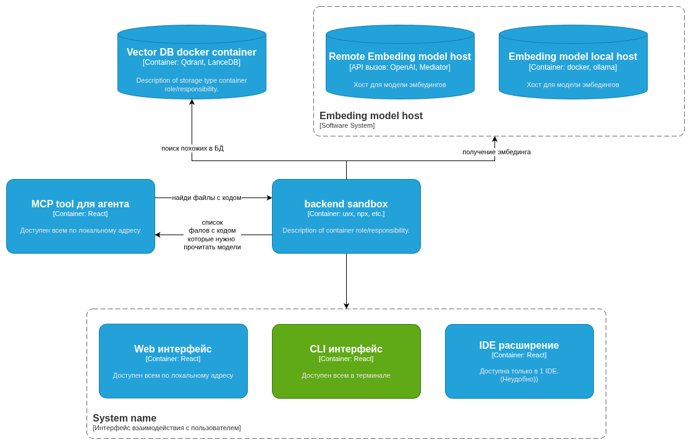

# Архитектура проекта

Проект представляет собой систему семантического поиска по коду (RAG - Retrieval Augmented Generation), состоящую из нескольких модулей, обеспечивающих индексацию, генерацию эмбеддингов и предоставление интерфейсов для взаимодействия.

## Компоненты системы

### 1. Backend Sandbox

Центральный компонент системы, выполняющий всю работу.

- **Технологии**: uvx, npx и другие инструменты выполнения в изолированной среде.

- **Ответственность**:
  - Обработка запросов на поиск кода.
  - Координация запросов между компонентами.
  - Взаимодействие с провайдерами эмбеддингов и векторной базой данных.

### 2. Vector DB (Векторная База Данных)

Контейнер для хранения векторных представлений (эмбеддингов) кода.

- **Технологии**: Qdrant, LanceDB (в Docker контейнере).
- **Ответственность**: Хранение и быстрый поиск похожих фрагментов кода по векторному представлению.
- **Взаимодействие**: Принимает запросы на "поиск похожих" от Backend Sandbox.

### 3. Embedding Model Host (Провайдер Эмбеддингов)

Подсистема генерации векторных представлений текста/кода. Может быть реализована в двух вариантах:

- **Remote Embedding model host**: Удаленный API (OpenAI, Mediator).
- **Embedding model local host**: Локальный хост (Docker, Ollama).
- **Взаимодействие**: Backend Sandbox отправляет текст/код и получает эмбеддинги.

### 4. MCP Tool для агента

Инструмент, реализующий Model Context Protocol (MCP) для интеграции с AI-агентами.

- **Доступность**: Локальный адрес.
- **Взаимодействие**:
  - Отправляет запрос "найди файлы с кодом" в Backend Sandbox.
  - Получает "список файлов с кодом" для чтения моделью.

### 5. Пользовательские интерфейсы

Набор интерфейсов для взаимодействия конечного пользователя с системой:

*   **Web интерфейс**:
    *   Технологии: React.
    *   Доступ: Локальный адрес (доступен всем).
*   **CLI интерфейс**:
    *   Доступ: Терминал.
*   **IDE расширение**:
    *   Технологии: React (WebView).
    *   Доступ: Внутри IDE (ограничен одной средой разработки).

## Потоки данных (Data Flow)

1.  **Поиск кода**:
    *   Запрос поступает через один из интерфейсов или MCP Tool в **Backend Sandbox**.
    *   **Backend Sandbox** при необходимости обращается к **Embedding Model Host** для получения вектора запроса.
    *   С полученным вектором **Backend Sandbox** выполняет поиск в **Vector DB**.
    *   Результаты (список файлов/фрагментов) возвращаются инициатору запроса (например, агенту через MCP).
