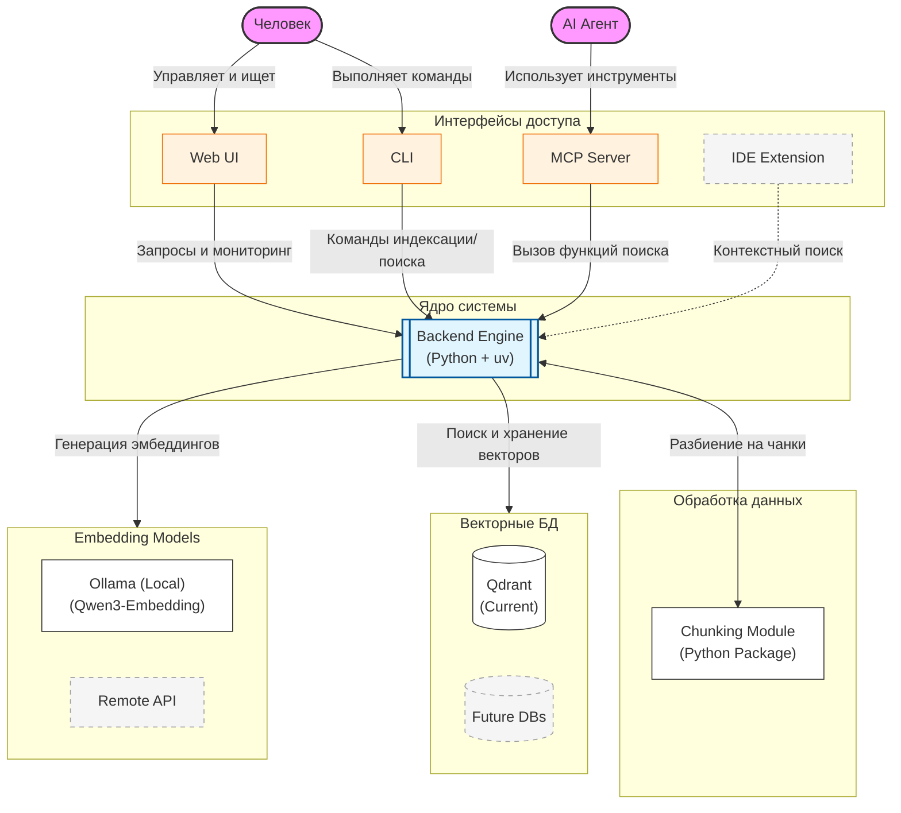

# Архитектура проекта rag4code

Система спроектирована как модульная платформа семантического поиска по коду, где каждый компонент является заменяемым модулем ("кирпичиком"). Архитектура разделяет потребителей (акторов), интерфейсы доступа и внутреннюю бизнес-логику.

## Схема компонентов (C4-style)

## Архитектурные принципы

Система строится на трех фундаментальных принципах:

1.  **Domain-Driven Design (DDD)**:
    *   Вся бизнес-логика (поиск, индексация, управление контекстом) сосредоточена в `Backend Engine`.
    *   Ядро полностью изолировано от внешних протоколов и интерфейсов. Это гарантирует чистоту кода и легкость тестирования.
2.  **LEGO-принцип (Modularity)**:
    *   Каждый инфраструктурный компонент (Vector DB, Embedder, Chunker) является заменяемым "кирпичиком".
    *   Взаимодействие происходит через четко определенные интерфейсы, что позволяет сменить, например, Qdrant на LanceDB без изменения логики ядра.
3.  **Thin MCP Layer**:
    *   MCP-сервер не содержит бизнес-логики. Это тонкий адаптер, который лишь транслирует возможности системы в формат, понятный AI-агентам.

## Компоненты системы

### 1. Backend Engine (Core Logic)
Центральный оркестратор на **Python (uv)**, реализующий всю бизнес-логику.
- **Роль**: Координация процессов индексации, поиска и формирования контекста.
- **Интерфейс**: Предоставляет единый внутренний API для всех внешних интерфейсов (Web, CLI, MCP).

### 2. Интерфейсы доступа
- **Web UI**: Панель для пользователя. Позволяет вводить запросы и визуализировать внутренние процессы системы (observability).
- **CLI**: Интерфейс командной строки для автоматизации и быстрой работы.
- **MCP Server**: Тонкий адаптер, открывающий возможности Backend Engine для AI-агентов по протоколу Model Context Protocol.
- **IDE Extension (Roadmap)**: Планируемый модуль для работы с RAG прямо из редактора кода.

### 3. Chunking Module
Отдельный Python-пакет, отвечающий за преобразование файлов в чанки.
- **Принцип**: "Files in -> Chunks out".
- **Текущая реализация**: `Simple Split`. Модуль легко заменяем на AST-based или семантические парсеры.

### 4. Vector DB (Storage Brick)
Модуль хранения векторных представлений.
- **Текущий кирпичик**: **Qdrant** (Docker).
- **Будущее**: Архитектура позволяет подключать LanceDB или другие векторные хранилища как альтернативные модули.

### 5. Embedding Model Host
Модуль генерации векторов (эмбеддингов).
- **Текущий кирпичик**: **Ollama** (локально) с моделью **Qwen3-Embedding**.
- **Будущее**: Поддержка удаленных API (OpenAI/Anthropic) через унифицированный интерфейс.

## Потоки данных (Data Flow)

1. **Индексация**:
   - `User/CLI` -> `Backend` -> `Chunker` (разбиение) -> `Embedder` (векторы) -> `Vector DB` (сохранение).
2. **Поиск (Query)**:
   - `User/Agent` -> `Interface` -> `Backend` -> `Embedder` (вектор запроса) -> `Vector DB` (поиск) -> `Backend` (формирование ответа).
