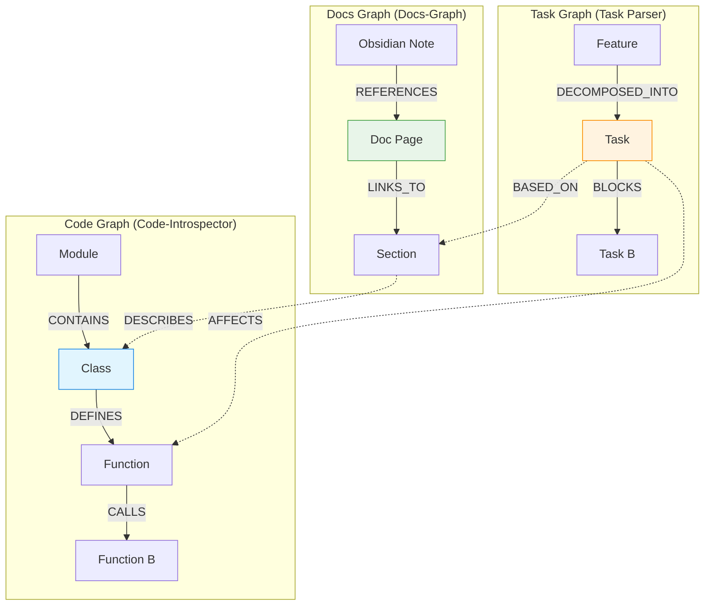

# Vision: HyperGraphMemoryRAG — AI-Native Knowledge Ecosystem

> **Статус**: Draft
> **Дата**: 2026-02-15
> **Основано на**: [Brainstorm Session](../brain_storm/long_talk.md), [HSM Methodology](../../hsm/website/static/img/main_page_final_draft_v2.md)

## 1. Суть проекта
**HyperGraphMemoryRAG** — это мета-инструмент (MCP Tool), который объединяет разрозненные данные проекта (код, документацию, задачи, историю Git) в единый **Гиперграф Знаний**.

Это не монолитное приложение, а экосистема независимых микросервисов и пакетов, управляемых через **HSM (Hyper Stack Manager)**. Каждый компонент (анализатор кода, чанкер, векторная база) является заменяемым модулем ("кубиком"), который можно переиспользовать в других проектах.

**rag4code** в этой архитектуре — это лишь один из дочерних компонентов, отвечающий за узкую задачу: семантический поиск по коду (RAG).

**Слоган**: *Bridging the gap between Markdown plans and Python code via HyperGraph.*

## 2. Проблема
Современные AI-агенты (Claude, Gemini) отлично пишут код, но страдают от "амнезии" и "туннельного зрения":
1.  **Разрыв контекста**: Планы лежат в Markdown (Obsidian/Tasks), код — в `.py` файлах, документация — в Docusaurus. Агент не видит связи между задачей "Refactor Auth" и классом `AuthService`.
2.  **Слепота к структуре**: RAG режет код на случайные куски (chunks), теряя иерархию классов и вызовов.
3.  **Отсутствие памяти**: Агент каждый раз заново изучает проект, не помня прошлых инсайтов и архитектурных решений.
4.  **Игнорирование истории**: Агент не знает, *почему* код написан именно так (Git History), и может случайно вернуть старый баг.

## 3. Решение: Многослойный Гиперграф
Мы строим систему, где Код, Знания и Задачи объединены в единый граф.

### Архитектура "Слоеный Пирог"
1.  **Слой Кода (Code Layer)**:
    *   Сущности: Модули, Классы, Функции.
    *   Связи: `CALLS`, `INHERITS`, `IMPORTS`.
    *   Инструменты: `Griffe`, `LibCST`, `Pyright`.
    *   **Ключевой компонент**: `Code-Introspector`.
        *   Строит граф взаимосвязей.
        *   Определяет точное расположение (строки) функций и классов.
        *   Обеспечивает навигацию "Go to Definition" для LLM.
2.  **Слой Знаний (Knowledge Layer)**:
    *   Сущности: Документация (Docusaurus), Заметки (Obsidian), ADR.
    *   Связи: `DESCRIBES`, `WARNS_ABOUT`.
    *   Инструменты: Полиморфный Markdown-парсер (`Docs-Graph`).
    *   *Примечание*: При работе с Obsidian Vault компонент `Docs-Graph` выступает в роли `Vault-Graph`.
3.  **Слой Задач (Task Layer)**:
    *   Сущности: Планируемые фичи, Бэклог, Текущие задачи.
    *   Связи: `AFFECTS`, `IMPLEMENTS`.
    *   Инструменты: Task Bank Parser.
4.  **Слой Истории (History Layer)**:
    *   Сущности: Коммиты, Ветки, Авторы.
    *   Связи: `INTRODUCED_IN`, `MODIFIED_BY`.
    *   Инструменты: `Git-Time-Machine`.
5.  **Слой Памяти (Memory Layer)**:
    *   Сущности: Инсайты агента, Исторические справки.
    *   Связи: `OBSERVED_IN`, `EVOLVED_FROM`.

## 4. Техническая Архитектура (HSM-Native)
Проект строится как набор независимых компонентов из **HSM Registry**. Это позволяет гибко менять реализации и масштабировать систему.

### Компоненты (Microservices / Packages)

| Компонент | Роль | Стек | Примечание |
| :--- | :--- | :--- | :--- |
| **Code-Introspector** | Навигация и анализ структуры кода | Python, FastMCP, Griffe | Строит граф вызовов, находит определения, мапит строки. **Бонус**: Безопасный рефакторинг (переименование) через LSP. |
| **Chunker** | Умная нарезка контента | Python | **3 режима**: 1. **Python Smart**: по функциям/классам. 2. **Markdown Smart**: по заголовкам. 3. **Standard**: фиксированный размер (fallback). |
| **rag4code** | Семантический поиск (RAG) | Python, Qdrant | Использует `Chunker` для подготовки данных и Vector DB для поиска. |
| **Docs-Graph** | Анализ Markdown (Obsidian, Docusaurus) | Python, NetworkX | Связывает доки и задачи. В режиме Obsidian работает как `Vault-Graph`. |
| **Relational-Context** | Хранение связей (Граф) | Neo4j | "Клей", соединяющий все слои. |
| **Git-Time-Machine** | Анализ истории и эволюции | GitPython | "Машина времени" для кода. |

### Потоки данных
1.  **Индексация**:
    *   `Code-Introspector` строит карту проекта (Граф).
    *   `Chunker` нарезает файлы (Код и MD) на смысловые куски.
    *   `rag4code` сохраняет эмбеддинги кусков в Vector DB.
2.  **Запрос**: Agent -> MCP Router -> Hybrid Search (Vector + Graph) -> Context.
3.  **Память**: Agent -> Create Insight -> Markdown File -> Graph Node.

## 5. Взаимодействие Графов (The HyperGraph)

Система оперирует тремя логическими графами, которые физически объединены в один **Гиперграф** (в Neo4j).

### Механика Слияния
1.  **Code Graph**: Строится автоматически через статический анализ (`Griffe`). Это "скелет" системы.
2.  **Docs Graph**: Строится парсингом Markdown (Docusaurus/Obsidian). Ссылки на код создаются через:
    *   Явные ссылки: `[AuthService](../src/auth.py)`.
    *   Неявные упоминания: `AuthService` (через NER/Regex).
    *   *Особенность*: Поддержка умного чанкинга (ссылки на конкретные разделы/заголовки).
3.  **Task Graph**: Строится из Frontmatter и структуры задач. Ссылки `focus_entities` жестко привязывают задачу к узлам Кода или Документации.

**Результат**: Агент может сделать запрос: *"Покажи все задачи, которые затрагивают `AuthService`, и документацию, где он описан"*.

## 6. Критический Анализ: UX Агента (Agent Cognitive Load)

### Риски
1.  **Перегрузка Контекста**: Если агент запросит "всё про `AuthService`", он получит граф из 50 узлов, 3 файла документации и 10 задач. Это "Context Flooding", который приведет к галлюцинациям.
2.  **Сложность Навигации**: Агенту нужно помнить, какой инструмент вызывать (`Code-Introspector` или `Docs-Graph`?).
3.  **Рассинхронизация**: Если агент поправил код, но забыл обновить задачу, граф станет неконсистентным.

### Решения (Mitigation Strategy)
1.  **Умная Фильтрация (Context Pruning)**:
    *   Инструменты возвращают не "всё подряд", а только **Top-K** релевантных узлов.
    *   Использование `summary` вместо полного текста для задач и документации.
    *   *Аналогия*: Это работает как **Skills**. Агент видит список доступных навыков (summary), но загружает полный промпт навыка (full content) только когда решает его использовать. Это "Lazy Loading" для мозга агента.
2.  **Единая Точка Входа (Unified Router)**:
    *   Агент не должен думать, какой граф опрашивать. Он вызывает один инструмент `search_context(query, type)`, а роутер сам решает, куда идти.
3.  **Активные Подсказки (Proactive Hints)**:
    *   Вместо того чтобы ждать вопроса, система сама добавляет в системный промпт: *"Ты работаешь над задачей X. Она связана с модулем Y. Внимание: есть 2 критических замечания в документации"*.
    *   *Реализация*: Агент-Архитектор при планировании задачи (в `tasks_descriptions/backlog/`) добавляет секцию `Hints` или `Context`, которую заполняет наш MCP-инструмент. Агент-Программист при реализации просто читает эту секцию как часть ТЗ.

## 7. Ключевые Сценарии (User Stories)

### 🕵️ "Зоркий глаз" (Structural Awareness)
> *Агент, дай мне структуру модуля `auth`.*
`Code-Introspector` возвращает дерево классов и функций. Агент видит карту местности без чтения гигабайтов текста.

### 🧭 "Навигатор" (Graph Navigation)
> *Агент, где определена функция `validate_token`?*
`Code-Introspector` мгновенно выдает файл и номер строки (Go to Definition), используя построенный граф.

### 🧠 "Умный RAG" (Smart Chunking)
> *Агент, как работает авторизация?*
`rag4code` находит не обрывки строк, а целиком функцию `login` (благодаря `Chunker` в режиме Python Smart) и связанную статью из документации (благодаря `Chunker` в режиме Markdown Smart).

### 📝 "Контекстный Планировщик" (Task Anchoring)
> *Агент, работай по задаче `task-42-refactor.md`.*
Агент читает задачу, видит ссылки `[[AuthService]]` и автоматически подгружает код этого сервиса.
*Примечание*: Этот сценарий интегрируется с `memory-bank/active.md`, превращая текущий контекст задачи в навигационную карту для агента.

### 🛠️ "Безопасный Рефакторинг" (LSP-Powered Rename)
> *Агент, переименуй `User.get_id()` в `User.id`.*
`Code-Introspector` использует LSP для поиска всех ссылок (References) и гарантирует, что переименование затронет только нужный метод, не ломая похожие методы в других классах.

## 6. Принципы Разработки
1.  **Spec-Driven**: Сначала Markdown-спецификация, потом код.
2.  **Composable AI Stack**: Каждый сервис — независимый "кубик" HSM.
3.  **Incremental MVP**:
    *   MVP 1: **Code-Introspector** (анализ структуры и навигация).
    *   MVP 2: **Chunker** (умная нарезка).
    *   MVP 3: **rag4code** (базовый поиск).
    *   MVP 4: **Docs-Graph** (связь с документацией и задачами).
    *   MVP 5: **Git-Time-Machine** (анализ истории).
    *   MVP 6: **Relational-Context** (глобальный граф и память).
4.  **Git as Truth**: Инкрементальная индексация на основе Git Diff.

## 7. Следующие шаги
1.  Создать репозиторий и структуру проекта (HSM init).
2.  Реализовать **MVP 1: Code-Introspector**.
3.  Реализовать **MVP 2: Chunker**.
