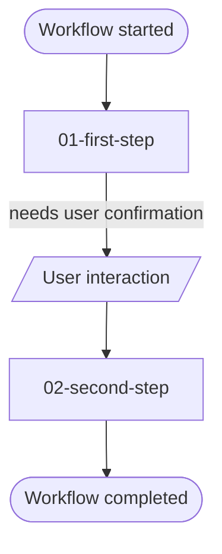

# Workflow: `<workflow-name>`

## Назначение workflow

Этот workflow описывает directed process graph для `<workflow-purpose>`.

## Preconditions

- `<precondition>`

## Execution scope

- `<scope-rule>`

## Graph overview

## Таблица вершин

| Vertex | Type | Meaning |
| --- | --- | --- |
| `Workflow started` | lifecycle marker | Вход в workflow run |
| `01-first-step` | workflow-step | `<meaning>` |
| `User interaction` | user interaction | `<human confirmation / verification / decision>` |
| `02-second-step` | workflow-step | `<meaning>` |
| `Workflow completed` | lifecycle marker | Нормальное завершение happy path |

## Таблица переходов

| From | To | Condition |
| --- | --- | --- |
| `Workflow started` | `01-first-step` | workflow run started |
| `01-first-step` | `User interaction` | human input required |
| `User interaction` | `02-second-step` | user interaction completed |
| `02-second-step` | `Workflow completed` | success |

## Happy path steps

1. [First Step](./01-first-step/STEP.md)
2. [Second Step](./02-second-step/STEP.md)

## Exception/remediation step

- `<optional-exception-step>`

## Важные invariants

- `<invariant>`
