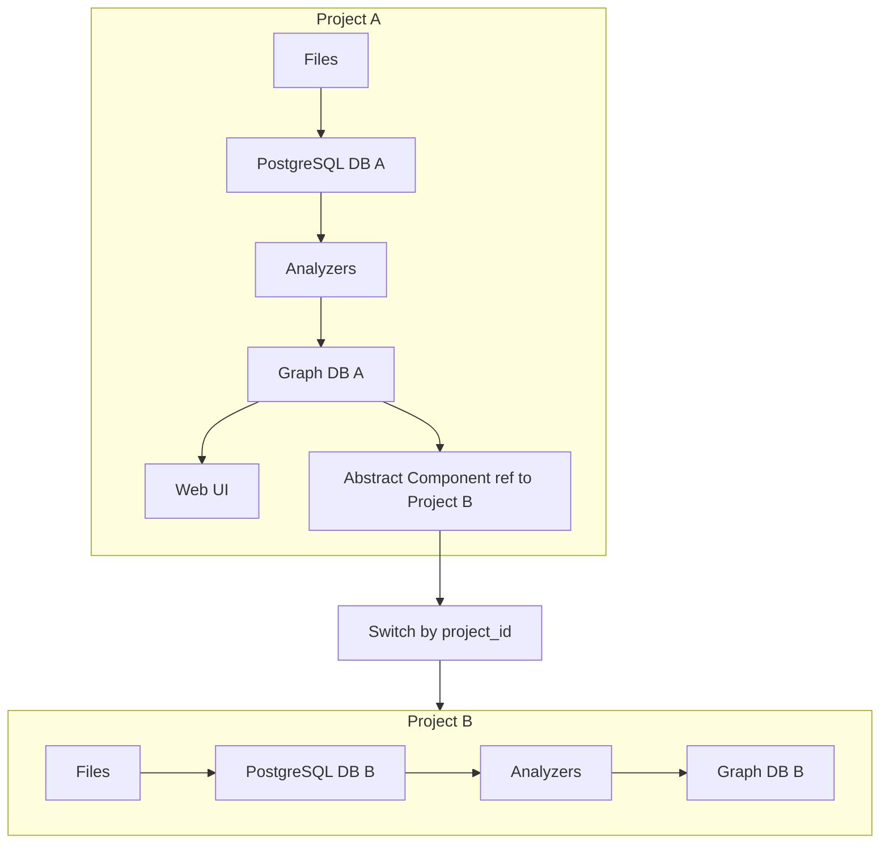

# Project-first Model and Storage Boundaries

> **Status**: Draft
> **Context**: продолжение визии HyperGraph и уточнение архитектурных инвариантов на уровне платформы.

## 1. Определения

### Project
**Project** — это директория на диске, заданная абсолютным путем `project_root`.

Инварианты проекта:
1. Внутри `project_root` есть **ровно один** Git-репозиторий.
2. Внутри `project_root` **нет вложенных** Git-репозиториев на файловой системе.
3. Все артефакты проекта — это файлы внутри `project_root`.

### Project ID
`project_id` — идентификатор проекта, используемый для:
- изоляции данных
- `switch(project_id)` (переход к контексту проекта)
- cross-project ссылок (когда проект использует другой проект)

> Open Question: как фиксировать `project_id` детерминированно: UUID в конфиге проекта или хэш.

### Artifact
**Artifact** — файл внутри проекта.

Ключевое правило путей:
- в БД проекта храним **relative paths** от `project_root`.
- абсолютный путь восстанавливается как `project_root + rel_path`.

## 2. Storage boundary и изоляция

### Принцип
**Изоляция на проект**: сбой или повреждение данных одного проекта не должен влиять на другие проекты.

### Базы данных на проект
Для каждого проекта мы описываем **логические хранилища** (модель — переносимая, реализация может меняться):

1) **SQL Store** — operational state
- base file-change index
- sync checkpoints
- (опционально) предметные таблицы/проекции

2) **Graph Store** — nodes/edges + traversal/query слой
- граф ссылок (docs graph)
- граф кода (code graph)
- мосты и абстрактные компоненты для внешних проектов

3) **Vector Store** — embeddings + similarity search

4) **KV Store** — компактный key/value слой (например, термины проекта, словари, настройки)

> Важно: runtime сервис БД может быть один (один Docker container/DBMS), но внутри него должны существовать изолированные базы/графы на проекты без enterprise-only зависимостей.

### MVP implementation (2026-03)
Для MVP реализацией всех логических хранилищ выбран **ArcadeDB**:
- один ArcadeDB container на HyperGraph runtime
- внутри: `1 project -> 1 ArcadeDB database`

Выбор зафиксирован в ADR: [`docs/adr/0001-arcadedb-as-unified-storage-for-mvp.md`](../../docs/adr/0001-arcadedb-as-unified-storage-for-mvp.md)

## 3. Модель вложенных проектов

### External Project Reference
Если внутри проекта A встречается сущность, которая является другим проектом B, то:

- В графе проекта A проект B отображается как **Abstract Component**:
  - интерфейсы
  - API/контракты
  - точки интеграции

- При этом есть `project_id` проекта B, и система должна поддерживать:
  - `switch(project_id)` для просмотра внутреннего устройства проекта B
  - навигацию «проект использует проекты»

## 4. Git-authoritative + projections

Базовый принцип:
- файлы в Git — source of truth
- SQL и Graph DB — derived projections, которые можно пересобрать

Это согласуется с `Git authoritative model`.

## 5. Инкрементальный ingestion паттерн (общий для сервисов)

### 5.1 SQL: Base File-Change Index
SQL используется как **универсальный индекс изменений файлов**.

Типовой минимум:
- `files`: `rel_path`, `mtime`, `size`, `content_hash`, `is_deleted`, `last_seen_at`
- `sync_checkpoints`: `checkpoint_id`, `started_at`, `finished_at`, `result`, `changed_files_count`

### 5.2 Analyzers: доменные анализаторы поверх changed files
Pipeline читает `changed_files` из SQL и прогоняет через доменные анализаторы:
- Markdown Links analyzer (docs/vault links)
- Code analyzer (static analysis + LSP)
- (позже) Patterns analyzer (findings)

### 5.3 Graph DB: транзакционное обновление edges
Инвариант обновления:
- для каждого source файла пересчитываем его outgoing edges
- применяем паттерн delete-outgoing + insert-new в одной транзакции

### 5.4 Reconcile
Периодический reconcile:
- полный проход
- сравнение projections с файлами
- исправление рассинхронов

## 6. MVP: Obsidian links

Для MVP в контексте Obsidian важны:
- только **links между заметками**
- обрабатываем **только markdown ссылки** ``
- пути в графе/SQL — относительные от `project_root`

## 7. Варианты Graph DB (open source, project isolation)

Требование: изоляция per project должна быть достижима без enterprise-only функций.

Кандидаты (по результатам research в `operational_scope/research/db-overview/`):
- ArcadeDB (multi-model: SQL + Graph + Vector + KV)
- PostgreSQL + Apache AGE (граф как расширение внутри Postgres)
- FalkorDB (multi-graph в одном инстансе)
- NebulaGraph (spaces)
- Neo4j Community — требует отдельные инстансы/контейнеры на проект и имеет GPL-лицензию

Решение для MVP принято:
- **ArcadeDB** как единый storage engine, при сохранении логической модели SQL/Graph/Vector/KV.

См. ADR: [`docs/adr/0001-arcadedb-as-unified-storage-for-mvp.md`](../../docs/adr/0001-arcadedb-as-unified-storage-for-mvp.md)

## 8. Диаграмма: проекты и переключение контекста

## 9. References
- Vision: [`operational_scope/ideas/HyperGraph_vision.md`](HyperGraph_vision.md)
- ADR: [`docs/adr/0001-arcadedb-as-unified-storage-for-mvp.md`](../../docs/adr/0001-arcadedb-as-unified-storage-for-mvp.md)
- Git authoritative: [`services/hyper-project-memory/docs/execution/plans/architecture-graph-git-versioning-strategy.md`](../../services/hyper-project-memory/docs/execution/plans/architecture-graph-git-versioning-strategy.md)
- Obsidian Assistant indexing baseline: [`services/obsidian-assistant/docs/spec/indexing.md`](../../services/obsidian-assistant/docs/spec/indexing.md)
- Research outputs: [`operational_scope/research/db-overview/`](../research/db-overview/)
